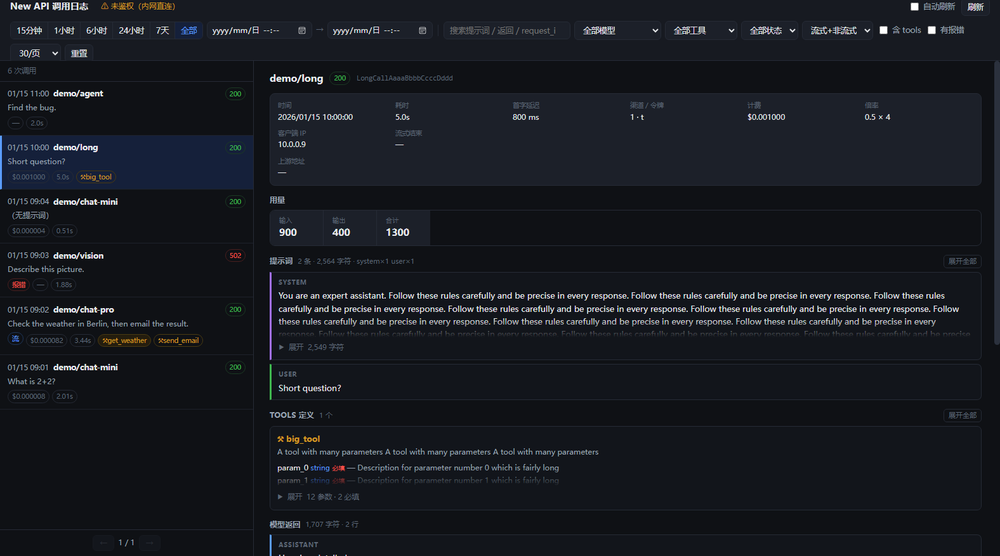

# newapi-logviewer

A read-only web viewer for [New API](https://github.com/QuantumNous/new-api) LLM call logs.

New API's built-in log page shows what a request *cost*. It does not show what was
*in* it. With `DEBUG=true`, New API writes the full outbound request body, the
upstream response body, and every streamed chunk to its file log — but as
interleaved lines that are painful to read by hand.

This service parses those files and serves a searchable UI: prompts, tool
definitions, tool calls, reasoning traces, token usage and billing, grouped per
call.

- **7 MB image, ~2 MB RSS idle.** Static Go binary on `scratch` — no OS, no shell, no interpreter.
- **Read-only.** The log directory is mounted `:ro`; the viewer cannot alter the audit trail.
- **No database, no state, no writes.** It only reads files New API already produces.



*Running against the synthetic `testdata/sample.log`.*

---

## Try it first

No New API instance needed — this serves the bundled sample log:

```bash
docker compose -f docker-compose.demo.yml up
```

Then open <http://localhost:7071/logviewer/>.

---

## Requirements

New API must be running with `DEBUG=true` and writing to a log directory:

```yaml
# in your new-api service
environment:
  - DEBUG=true         # logs request/response bodies; also lifts the 2048-char
                       # truncation on upstream error bodies
  - LOG_DIR=/app/logs  # or wherever; mount it somewhere you can share
volumes:
  - ./logs:/app/logs
```

Without `DEBUG=true` the log contains only routine lines and this viewer will
show nothing useful.

> **`DEBUG=true` writes every prompt and response to disk in plaintext**, with no
> rotation. Read [Security](#security) before enabling it.

## Quick start

```bash
git clone https://github.com/<you>/newapi-logviewer
cd newapi-logviewer
cp .env.example .env
$EDITOR .env            # set NEWAPI_LOG_DIR and TZ
docker compose up -d
```

Then open <http://localhost:7071/logviewer/>.

To run it alongside an existing New API stack, see
[examples/newapi-stack.yml](examples/newapi-stack.yml).

### Or: one container instead of two

`Dockerfile.combined` bakes the viewer into the New API image and runs both
processes under a small supervising entrypoint. One container, one port mapping,
nothing extra to manage:

```bash
docker build -f Dockerfile.combined -t newapi-with-logviewer .
```

```yaml
services:
  new-api:
    image: newapi-with-logviewer
    ports:
      - "3000:3000"
      - "7071:7070"     # viewer, same container
    volumes:
      - ./logs:/app/logs
    environment:
      - DEBUG=true
      - AUTH_MODE=none
      - LOGVIEWER_ENABLED=true   # false runs New API alone
```

See [examples/combined-stack.yml](examples/combined-stack.yml) for a full stack.

The entrypoint forwards SIGTERM to both processes (so `docker stop` takes
milliseconds, not the 10s SIGKILL timeout), exits the container if *either*
process dies rather than sitting half-alive, and drops the viewer to `nobody`
while New API keeps the root it needs for `/data`.

The trade-off is coupling: restarting the viewer restarts your gateway, and a
viewer crash takes New API down with it (which is why it fails loudly instead of
silently). Use the separate container if you would rather they fail
independently.

### Without Docker

```bash
go build -o logviewer .
LOG_DIR=/path/to/new-api/logs BASE_PATH=/logviewer ./logviewer
```

## Configuration

All configuration is environment variables. Only `LOG_DIR` matters for a basic run.

| Variable | Default | Meaning |
|---|---|---|
| `LOG_DIR` | `/logs` | New API's log **spool**. Disposable; put it on tmpfs |
| `ARCHIVE_DIR` | `/archive` | Where folded records are kept. **This is the permanent store — back it up** |
| `PORT` | `7070` | Listen port |
| `BASE_PATH` | `/logviewer` | URL prefix. Use `/` to serve at the root |
| `TZ` | container default | **Must match New API's timezone** — see below |
| `AUTH_MODE` | `none` | `none` or `bearer` |
| `NEWAPI_URL` | `http://new-api:3000` | Where to validate tokens (`bearer` mode only) and resolve channel names |
| `NEWAPI_TOKEN` | *(unset)* | Admin access token, used only to show **channel names** in the list. Without it the list shows the upstream address |
| `REQUIRE_ADMIN` | `true` | In `bearer` mode, also require `role >= 100` |
| `SPOOL_KEEP_MIN` | `60` | Minutes an already-archived spool file may linger |
| `SPOOL_MAX_MB` | `256` | Spool high-water mark; consumed files are dropped oldest-first past it |
| `INGEST_EVERY_SEC` | `2` | How often the spool is checked for new lines |
| `SEARCH_DAYS` | `7` | How far back full-text search reads bodies. Listing is unbounded |
| `LOGVIEWER_ENABLED` | `true` | Combined image only: `false` runs New API alone |
| `AUTH_TTL` | `120` | Seconds to cache a token verdict |

## Storage

New API with `DEBUG=true` writes a lot, and almost none of it is information.
Measured on a real gateway (347MB of log):

| Line type | Lines | Bytes | Share |
|---|---|---|---|
| streaming chunks | 1,112,619 | 273 MB | **76%** |
| request bodies | 642 | 85 MB | 24% |
| everything else | 30,733 | 3.9 MB | <1% |

Each chunk line repeats a ~250-byte envelope around a couple of characters:

```
... | stream scanner data: data: {"id":"chatcmpl-313b…","choices":[{"index":0,
"delta":{"content":"第一百","role":"assistant"},"finish_reason":null,…}],
"created":1786257871,"model":"deepseek…","service_tier":null,
"system_fingerprint":null,"object":"chat.completion.chunk"}
```

A further 18% of all bytes are blank keepalive lines carrying nothing.

So the viewer treats `LOG_DIR` as a **spool** and `ARCHIVE_DIR` as the record.
A finished call's chunks are concatenated into one record — keeping the text,
the chunk count and time-to-first-token, discarding the repeated envelope — and
the spool file is deleted. Nothing the UI can display is lost.

Put the spool on tmpfs and those 273MB never reach a disk at all:

```yaml
services:
  new-api:
    tmpfs:
      - /app/logs:size=256m,mode=1777
```

Measured end to end on that same gateway: **363MB of raw log → 36MB of archive**,
and resident memory went from 196MB to 12MB.

### Archive format

One file pair per day, in `ARCHIVE_DIR`:

```
arc-20260809.jsonl.gz   concatenated gzip members, one per record
arc-20260809.idx        one JSON line per record: list metadata + offset/length
```

Both properties matter:

- **Readable without this tool.** gzip members concatenate, and each record ends
  with a newline inside its member, so `gunzip -c arc-DAY.jsonl.gz | jq -c .`
  works on the whole day.
- **Randomly accessible.** The `.idx` carries each member's byte offset, so
  opening one record inflates that record alone. Per-record framing costs ~16%
  versus compressing the day as one stream — cheap for O(1) detail reads.

The archive is append-only. Correcting a record means appending a new version of
it; the reader takes the last one. That is what `-reingest` does after a parser
fix:

```bash
# re-parse raw logs into a scratch archive, then graft the fixes onto the live one
logviewer -reingest -src /scratch/archive -day 20260809 [-only <request-id>,…]
```

Existing bytes are never rewritten, so a failure part-way leaves every
previously-readable record exactly as readable as before.

The `.idx` is *derived* — every field in it also exists inside the record it
points at. So a new list column can be backfilled onto history without the raw
logs, which by then have usually been rotated away:

```bash
logviewer -reindex [-day 20260809]     # rebuild arc-DAY.idx from arc-DAY.jsonl.gz
```

Run it with the server stopped: a live ingester holds the `.idx` open in append
mode, and swapping the file under it would send its appends to the replaced
inode. Only the index is rewritten — via a temp file and a rename, so a failure
leaves the previous one in place.

### Which channel served a call

The list shows the channel per row, because on a real gateway the model name is
not enough — the same model is usually served by several keys with different
quotas and failure modes.

New API logs the channel **id**, never its name, and the upstream address
often can't stand in: measured here, 22 of 33 channels share
`integrate.api.nvidia.com`. So the name is fetched from New API's own admin API
and cached (5 min), which is the one thing in this service that reads anything
other than a file:

```yaml
environment:
  - NEWAPI_TOKEN=<admin access token>
```

It is optional and degrades in order: **name** → **upstream host** → **`#id`**.
With no token nothing is fetched and no request is made. A call rejected before
channel selection — `No available channel for model X` — has no channel at all
and shows none.

> The token is an *admin* access token: it grants full administrative access to
> New API, not just channel reads. Leave it unset if that trade is not worth a
> name in a list.

### Timezone

New API's log lines carry no UTC offset:

```
[DEBUG] 2026/01/15 - 09:01:10 | <request-id> | text request body: {...}
```

They are local wall-clock time in whatever zone New API runs in. This service
interprets them using its own `TZ`, so **if the two disagree, every timestamp is
off by the difference and the time-range filter silently returns wrong rows.**
Set `TZ` to the same value New API uses.

The timezone database is compiled into the binary, so `TZ` works even though the
image has no `/usr/share/zoneinfo`.

## Authentication

**`AUTH_MODE=none`** (default) — no authentication. Anyone who can reach the URL
reads every prompt, response and tool argument. Only acceptable on a trusted
network.

**`AUTH_MODE=bearer`** — every request must carry a New API **dashboard access
token**:

```
Authorization: Bearer <access_token>
```

The token is validated against New API's `/api/user/self`, so revoking it in New
API revokes access here. With `REQUIRE_ADMIN=true` (default) the account must
also be an admin (`role >= 100`).

Two caveats worth knowing before you pick this mode:

- **A relay API key (`sk-...`) will not work.** New API's `/api/user/self`
  rejects relay keys — they authenticate a different code path. You need a
  dashboard access token.
- **A browser cannot supply this automatically.** New API's SPA keeps its access
  token in memory (bare zustand, no persist middleware), so there is no cookie or
  `localStorage` entry for a reverse proxy or this service to pick up. `bearer`
  mode is practical for scripted access; for browsing, put the viewer behind your
  own auth (see below) and leave `AUTH_MODE=none`.

`/healthz` is always reachable without a token.

### Recommended: put it behind your reverse proxy's auth

Since browser-side token auth is impractical, the realistic setup is
`AUTH_MODE=none` plus authentication at the proxy. Example with nginx basic auth:

```nginx
location /logviewer/ {
    auth_basic "log viewer";
    auth_basic_user_file /etc/nginx/.htpasswd;

    proxy_pass http://logviewer:7070/logviewer/;
    proxy_set_header Host $http_host;
    proxy_set_header X-Real-IP $remote_addr;
    proxy_set_header X-Forwarded-For $proxy_add_x_forwarded_for;
    proxy_set_header X-Forwarded-Proto $scheme;
    proxy_http_version 1.1;
}
```

See [examples/nginx.conf](examples/nginx.conf) for a full server block, including
the SSE settings New API itself needs on the main location.

## The UI

Master-detail: pick a call on the left, read it on the right. The splitter drags
and remembers its width. Below 860px it stacks vertically.

**Filtering** — time (quick presets or a custom `datetime-local` range), free-text
search across prompts/responses/request-id, model, tool name, status, streaming,
has-tools, has-errors.

**List rows** show timestamp, model, status, cost, latency, and tool chips.
A chip is highlighted when that tool was *actually called*, outlined when it was
merely *defined* — the distinction matters when debugging why a model ignored a
tool. Clicking a chip filters by it.

**Detail pane** — overview (latency, first-token latency, channel, token name,
cost, ratios, upstream URL), token usage including reasoning and cached tokens,
the full message list with roles, tool definitions with parameter schemas,
model output, tool calls with formatted arguments, reasoning traces, request
parameters, and the raw response JSON.

**Agent transcripts are grouped into cards.** A single call can carry a
130-message conversation with 20 tool definitions — one API call, dozens of
model round-trips already in its `messages` array. Rendering that flat is
unreadable, so:

- the **tool catalogue** is one collapsed card at the top (`20 个可用 · 本次调用 1`),
- the **conversation** becomes one card per turn — an assistant message plus the
  tool results it produced — with a header line showing which tools ran and how
  much output came back (`#7 调用 ⚒read ⚒grep · 3 结果 · 14,814 字符`),
- long standalone messages (a 16k-char system prompt) start collapsed too.

Default view is ~4 screens instead of ~37 for the same call.

**Long blocks collapse.** Prompts, tool schemas, model output and raw JSON are
clamped to a few lines, with a summary of what is hidden — `16,118 字符 · 235 行`
for text, `9 参数 · 1 必填` for a tool schema, `2 个工具调用 · 93 字符` for an
assistant turn that only called tools. Click to expand; each section header also
has a 展开全部 / 收起全部 toggle.

The toggle only appears on blocks that genuinely overflow. Whether something
overflows depends on wrapping, so it is measured against the real layout after
render rather than guessed from a character count — a short prompt renders in
full with no toggle at all.

Streamed responses are reassembled: chunks are merged back into content,
reasoning, and tool calls, so a streaming call reads the same as a
non-streaming one.

### What it cannot show

**HTTP headers.** New API does not log them — not request headers, not response
headers. There is no header-logging code in the upstream source, so no amount of
parsing recovers them. The closest available data is upstream metadata that some
gateways emit as SSE comment lines, which shows up in the raw response section.

If you need headers, they have to be added to New API itself.

## API

The UI is a client of a small JSON API you can script against.

```
GET /api/calls?page=1&page_size=30&search=&model=&tool_name=&status=&stream=
               &tools=&errors=&since=&until=&refresh=
GET /api/call?id=<request_id>
GET /healthz
```

`since` / `until` are epoch seconds. `refresh=1` forces a re-parse.

`/api/calls` returns `{total, page, page_size, models, tools, items}` — `models`
and `tools` are the full sets across all records, for populating filter dropdowns.

```bash
# every call that invoked a given tool, as JSON
curl -s 'http://localhost:7071/logviewer/api/calls?tool_name=get_weather&page_size=100' \
  | jq '.items[] | {ts, model, called_tools, quota}'
```

## Security

This service shows **complete prompts and responses**. Treat access to it as
equivalent to access to your LLM traffic.

- `DEBUG=true` writes all of that to disk in plaintext, and New API does **not**
  rotate those files. Add logrotate, or the directory grows until the disk fills.
  See [docs/logrotate.md](docs/logrotate.md).
- The log mount is `:ro` and the process runs as `nobody` (65534). It has no
  shell — the `scratch` image contains one file.
- Never commit real logs. `.gitignore` excludes `*.log` for this reason.
- The viewer never writes anything, anywhere.

## How it works

New API emits one line per event, all tagged with a request id:

```
[DEBUG] 2026/01/15 - 09:01:10 | <rid> | text request body: {...}
[DEBUG] 2026/01/15 - 09:01:12 | <rid> | upstream response body: {...}
[DEBUG] 2026/01/15 - 09:02:31 | <rid> | stream scanner data: data: {...}
[INFO]  2026/01/15 - 09:01:12 | <rid> | record consume log: userId=1, params={...}
[GIN]   2026/01/15 - 09:01:12 | relay | <rid> | 200 | 2.01s | 10.0.0.9 | POST /v1/...
```

Events from concurrent calls interleave, so the parser groups by request id and
derives per-call summaries. Some deliberate choices:

- **Request and response bodies are never unmarshalled into maps.** They are kept
  as raw bytes and spliced into the API response; only a small "partial view"
  struct is decoded to pull out the handful of fields the list needs. This is
  most of the memory difference versus a naive implementation.
- **The search haystack is built once at parse time**, so a keystroke in the
  search box does not re-serialize every record.
- **Parsing is incremental.** The store remembers the byte offset reached in
  each file and reads only what was appended. This matters more than it sounds:
  on a busy gateway the active log grows continuously, so a mtime check never
  says "unchanged" and a naive implementation re-parses the whole directory on
  every request. Measured on a 330MB log directory: 8s on the first request,
  then ~30ms.
- **The list endpoint sends summaries, not bodies.** One agent record is ~1MB of
  request/response JSON; returning 30 per page made `/api/calls` a 25MB,
  20-second response just to draw a list. Full records come from `/api/call`
  when a row is opened.
- **Truncated or rotated-out bodies do not drop a record.** It is flagged
  `incomplete` and rendered with whatever fields survive.

## Development

```bash
go test ./...                       # golden tests over testdata/sample.log
go test -race ./...                 # concurrency (needs CGO_ENABLED=1)
go vet ./...
node channel_test.js                # channel column fallback chain, no browser
```

`testdata/sample.log` is synthetic and covers the shapes that matter: a plain
call, a streaming call with tools and reasoning, a multimodal request, an
upstream error, a truncated body, an assistant turn that only calls tools (no
text content), and non-call noise.

The collapsing behaviour is layout-dependent, so it is verified in a real
browser rather than a DOM stub:

```bash
msedge --headless=new --disable-extensions --remote-debugging-port=9222   --user-data-dir=/tmp/prof about:blank &
go build -o logviewer . && LOG_DIR=./testdata BASE_PATH=/logviewer ./logviewer &
npm install ws --no-save
node clamp_test.js 9222 http://localhost:7070/logviewer/
node channel_render.js 9222 http://localhost:7070/logviewer/   # channel chips
```

Run it against a real deployment too — the fixture cannot produce a 16,000-char
prompt or a 26-message conversation, and both change what overflows.

The UI is a single `ui.html` embedded into the binary with `go:embed` — no build
step, no bundler, no static-file mount to keep in sync. Edit it and rebuild.

## Compatibility

Developed against New API `v1.0.0-rc.24`. The parser keys off log line formats
rather than internal APIs, so it should tolerate minor version drift; a format
change in New API's logging would need a parser update.

## License

MIT
